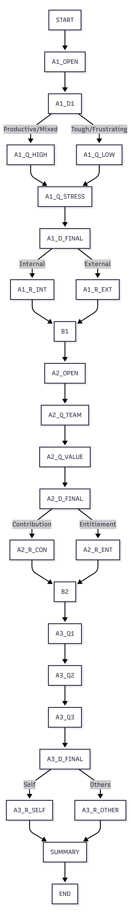

# Daily-Reflection-Tree

This project implements a deterministic end-of-day reflection tool using a structured decision tree.

## 🧠 Concept

The system guides users through three psychological axes:

1. **Locus of Control** (Internal vs External)
2. **Contribution vs Entitlement**
3. **Radius of Concern** (Self vs Others)

## 🌳 Structure

* Each node represents a question, decision, or reflection
* Users select from fixed options
* Each choice leads to a predefined path
* No AI is used at runtime

## 📁 Project Structure

```
tree/
  reflection-tree.json
  tree-diagram.md
  tree-diagram.png

README.md
write-up.md
```

## 🧮 Determinism

* Fixed options only
* Signals are assigned per answer
* Dominant signal determines reflection

### Tie-breaking:

* Axis 1 → external
* Axis 2 → entitlement
* Axis 3 → self

## 🖼️ Tree Diagram



## 🎯 Goal

To help users:

* Recognize their agency
* Shift toward contribution
* Expand perspective beyond self
