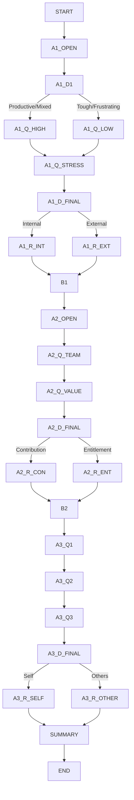

# Daily Reflection Tree Diagram

```mermaid
graph TD

START --> A1_OPEN --> A1_D1

A1_D1 -->|Productive/Mixed| A1_Q_HIGH
A1_D1 -->|Tough/Frustrating| A1_Q_LOW

A1_Q_HIGH --> A1_Q_STRESS
A1_Q_LOW --> A1_Q_STRESS

A1_Q_STRESS --> A1_D_FINAL

A1_D_FINAL -->|Internal| A1_R_INT --> B1
A1_D_FINAL -->|External| A1_R_EXT --> B1

B1 --> A2_OPEN --> A2_Q_TEAM --> A2_Q_VALUE --> A2_D_FINAL

A2_D_FINAL -->|Contribution| A2_R_CON --> B2
A2_D_FINAL -->|Entitlement| A2_R_ENT --> B2

B2 --> A3_Q1 --> A3_Q2 --> A3_Q3 --> A3_D_FINAL

A3_D_FINAL -->|Self| A3_R_SELF --> SUMMARY
A3_D_FINAL -->|Others| A3_R_OTHER --> SUMMARY

SUMMARY --> END
```
